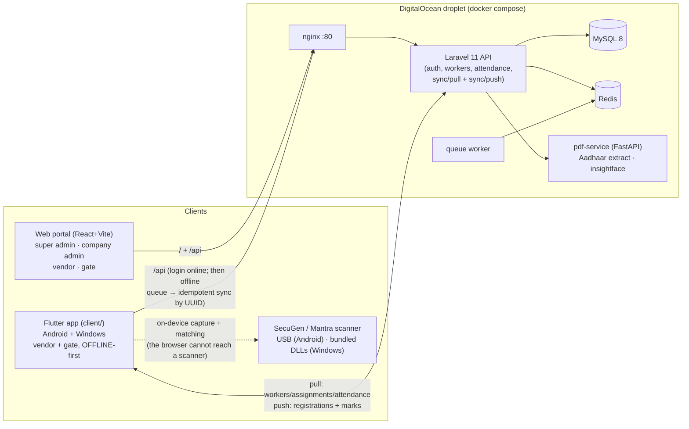

# TrueCrew — Every Worker Verified

> Product name: **TrueCrew** (हाज़री — "attendance"). Internal/technical codename remains **AMS** (repo, containers `ams_*`, API paths) — do not rename infrastructure.

Enterprise multi-company, multi-contractor labour registration, biometric attendance
and wage system built on Laravel + React, with offline-first Android and Windows apps.

> **Wording:** user-facing text says **contractor**. The database, API and role keys
> still say `vendor` (`vendor_id`, `vendor_admin`, `/api/vendors`) — do not rename them.

---

## Architecture

### System overview (web v1.19.0 · apps v0.9.38)



- **Offline model:** app keeps an encrypted local SQLite copy; events (registrations,
  attendance marks) queue with client UUIDs and push idempotently; master data pulls
  role-scoped bundles — **server wins** on master data, events are append-only.
- **Biometrics live in the apps only.** A browser cannot reach a fingerprint scanner,
  so attendance marking was removed from the web portal. The Android and Windows apps
  capture and match on-device (SecuGen + Mantra drivers, DLLs bundled — zero setup on
  Windows), and the server re-verifies every mark. Up to **three fingers** per worker;
  face matching via InsightFace. Sim mode works with no hardware.
- **Payroll** converts attendance into wages: daily rate by default (this is built for
  contract labour, not salaried staff), Indian wage heads, PF/ESI/PT/LWF, paid
  government holidays and overtime. See `CLAUDE.md` for the rules.

### Repository layout

```
truecrew/
├── client/                     # Flutter app (Android + Windows) — offline-first,
│   │                           #   owns ALL biometrics; scanner DLLs ship inside
│   └── windows/sgfp/           # SecuGen x64 runtime DLLs (committed, CI-bundled)
├── docker-compose.yml          # All services wired together
├── docker-compose.local.yml    # Local dev override (Mac port clashes + sim mode)
├── init.sh                     # One-time setup script
├── .env.example                # Copy to .env before starting
│
├── nginx/                      # Reverse proxy config
├── docker/mysql/               # MySQL init SQL + seed
├── deploy/production/          # Production pack (setup.sh, TLS nginx, annotated .env)
│
├── backend/                    # Laravel 11 (PHP 8.4 + FPM)
│   ├── app/Http/Controllers/   # API controllers (per resource)
│   │   ├── AttendanceController.php     # mark, daily-summary, exports, manual entry
│   │   ├── PayrollController.php        # wage register, muster, rates, holidays
│   │   ├── WorkerController.php         # CRUD + fingerprint + stats + photo
│   │   ├── AadhaarController.php        # extract, upload, download (role-scoped)
│   │   ├── PanController.php            # same, for PAN cards
│   │   ├── VisitorController.php        # gate passes + host approval
│   │   └── ...
│   ├── app/Services/           # Audit, Biometric, Payroll, Notify, Plan,
│   │                           #   Template, Face, Aadhaar
│   ├── app/Support/Csv.php     # CSV writer that neutralises formula injection
│   ├── database/migrations/    # Full schema history
│   └── routes/api.php          # All API routes
│
├── frontend/                   # React 18 + Vite + Tailwind CSS
│   └── src/
│       ├── pages/              # Dashboard, Reports, Payroll{,Wages,Settings},
│       │   │                   #   Signup, PlanBilling, Subscriptions, Downloads
│       │   ├── companies/      # CompanyList
│       │   ├── vendors/        # VendorList, VendorApproval, VendorDetail,
│       │   │                   #   VendorCompanyAccess  (shown as "Contractors")
│       │   ├── workers/        # WorkerList, WorkerDetail, WorkerRegister, WorkerAssign
│       │   ├── users/          # UserList
│       │   ├── visitors/       # Visitors (gate passes)
│       │   └── attendance/     # AttendanceList (daily summary), Exceptions, LiveBoard
│       ├── components/         # Sidebar, MultiSelect, LiveCapture,
│       │                       #   ManualAttendance, ImportWorkersModal, charts
│       └── lib/scope.js        # useOrgScope() — the single own-company display rule
│
└── pdf-service/                # Python FastAPI
    ├── main.py                 # HTTP surface
    ├── card_ocr.py             # Shared Aadhaar/PAN card reader (never thresholds)
    ├── aadhaar_parser.py       # Aadhaar PDF + photo
    └── pan_parser.py           # PAN PDF (password = DOB) + photo
```

---

## Quick Start

### Prerequisites
- Docker Desktop (Windows / Mac / Linux)
- Git Bash or WSL (Windows users)

### 1. First-time setup
```bash
cp .env.example .env
bash init.sh
```

### 2. Start / Stop
```bash
docker compose up -d      # any OS
docker compose down
```
On a Mac, add the local override — it avoids host port clashes and turns on sim mode:
```bash
docker compose -f docker-compose.yml -f docker-compose.local.yml up -d
```
Windows users can use `up.bat` / `down.bat`, which also create `.env` and generate an
`APP_KEY` on first run.

### 3. Access the application

| Service     | URL                   |
|-------------|-----------------------|
| App (UI)    | http://localhost      |
| API         | http://localhost/api  |
| PDF Service | http://localhost:8001 |

Redis has no published host port — it clashed with other local projects. Reach it with
`docker exec ams_redis redis-cli`.

### Default Login Credentials

| Role          | Email                | Password    |
|---------------|----------------------|-------------|
| Super Admin   | superadmin@ams.local | Admin@12345 |
| Company Admin | company@ams.local    | Admin@12345 |
| Gate User     | gate@ams.local       | Admin@12345 |
| Vendor Admin  | vendor@ams.local     | Admin@12345 |

---

## Core Business Flow

```
0. Anyone signs up at /signup as a Company or a Contractor (free trial)
       │
       ▼
1. Company Admin creates their own contractors (auto-approved), or a contractor
   signs up and requests access, which the company approves
       │
       ▼
2. Contractor Admin registers workers
       ├── Aadhaar OR PAN — photo or PDF, auto-extracted
       ├── Employment tab: designation, grade, PF/ESI, bank, wage rate
       └── Fingerprint enrolled at the gate in the app (web registration
           saves the worker as "pending" until then)
       │
       ▼
3. Contractor deploys a worker to a company for a date range
       └── Company Admin or HR approves it, and picks the gates they may use
       │
       ▼
4. Gate user marks IN / OUT in the desktop or Android app (offline-capable);
   the server re-verifies every mark
       └── A day the gate missed → "Add a missed day": the company enters it,
           or the contractor raises it and the company approves
       │
       ▼
5. Payroll converts those days into wages
       ├── Rate per day (monthly supported for salaried staff)
       ├── Paid government holidays, overtime, PF/ESI/PT/LWF
       ├── A rate the contractor proposes waits for company approval
       └── Wage register / muster / per-contractor bill — Excel or CSV
```

---

## Roles & Permissions

| Role              | What they can do                                                                    |
|-------------------|-------------------------------------------------------------------------------------|
| `super_admin`     | Platform owner — creates orgs, manages all users, sets plans                         |
| `company_admin`   | Creates & approves contractors, gate users, billing; **approves wage changes**       |
| `company_hr`      | Approves deployments and manual attendance, assigns departments; no users/billing    |
| `company_gate`    | Marks IN/OUT at their gate, **in the desktop or Android app**; raises visitor passes |
| `vendor_admin`    | Registers workers, deploys them, proposes wage rates, raises missed days             |
| `vendor_operator` | Registers workers only                                                               |

`company_hr` can approve a manual attendance day but **not** a wage change — agreeing a
new cost is the admin's call. A contractor can propose either and decide neither.

---

## Key Pages & Features

### Workers
- **WorkerList** (`/workers`) — All / Current / Previous tabs; clickable rows → Worker Detail; ID document column with download links for Aadhaar PDF and other docs
- **WorkerDetail** (`/workers/:id`) — Analytics page: total days, avg hours, monthly breakdown. Company users see only their company's data. Vendor users get a company dropdown to filter per-company; includes deployment history
- **WorkerRegister** (`/workers/register` or `/workers/:id/edit`) — 4-step wizard; edit mode shows existing Aadhaar/document download links
- **WorkerAssign** (`/workers/assign`) — Deploy workers to companies; Current / Previous / All tabs; can cancel even locked deployments if worker is currently checked OUT

### Attendance
- **AttendanceList** (`/attendance`) — Daily summary grouped view: per worker per day shows First IN, Last OUT, duration, and status (Inside / Done / Incomplete). All / Current Workers / Previous Workers tabs. Row click → Worker Detail
- **Exceptions** (`/attendance/exceptions`, shown as *Still Inside*) — Workers checked IN without an OUT
- **LiveBoard** (`/live`) — Who is on site right now: occupancy, per-gate cards, hourly flow
- **Manual attendance** — *Add a missed day* on the Attendance Log records a day the gate
  missed. A company admin or HR enters it directly; a contractor raises it and the company
  approves. Only against an approved deployment, never over a day that already has logs,
  reason mandatory, and always stamped `method=manual`

> **Attendance marking is not in the web portal.** A browser cannot reach a fingerprint
> scanner, so it lives in the desktop and Android apps.

### Contractors (`vendor` internally)
- **VendorList** (`/vendors`) — Super admin: full global list + create/edit. Company users: approval-status tabs (Approved / Pending / Suspended / Rejected / All) showing only their company's vendor relationships
- **VendorApproval** (`/vendors/approval`) — Pending / Approved / Rejected / Suspended tabs with counts; approve, reject with reason, suspend, re-approve
- **VendorCompanyAccess** (`/vendors/company-access`) — Contractor-side: request access to companies, track statuses
- **VendorDetail** (`/vendors/:id`) — Company view of one contractor, gated on their consent

### Payroll
- **Payroll** (`/payroll`) — Wage register for a pay cycle, muster grid, per-contractor
  billing summary. Excel and CSV. Filter to one contractor, several, or all
- **PayrollWages** (`/payroll/wages`) — What each worker is paid. A rate a **contractor**
  proposes for a deployed worker waits for the company to approve it; the agreed rate
  keeps applying meanwhile. Per-row button to fix a missed attendance day
- **PayrollSettings** (`/payroll/settings`) — Government holidays, weekly offs, overtime
  multipliers per skill grade

### Everything else
- **Dashboard** (`/dashboard`) — Role-aware KPIs, trends, charts, attention chips
- **Reports** (`/reports`) — Report tiles, client-side filters, Excel/CSV of exactly the
  filtered view, hours-to-wage-days conversion (8h = 1 day, 4h = half)
- **Visitors** (`/visitors`) — Gate passes with live photo, vehicle number and photo;
  one-tap host approval by link. Gate staff raise, admin/HR decide
- **Signup** (`/signup`, public), **PlanBilling** (`/billing`), **Subscriptions** (`/subscriptions`)

---

## Identity: Aadhaar **or** PAN

1. On Worker Register page, click **Open UIDAI Portal**
2. Worker logs in on UIDAI site, completes OTP, downloads masked Aadhaar PDF
3. Vendor uploads the PDF — Python service extracts: name, DOB, gender, address, PIN, photo
4. Form auto-fills; vendor reviews and saves
5. PDF stored on private disk (never web-accessible); served via authenticated download endpoint
6. Company users can download a worker's Aadhaar PDF if the worker has ever been deployed to or attended at their company

**Aadhaar PDF password:** first 4 letters of name (uppercase) + birth year —
"Narendra", born 1955 → `NARE1955`. **e-PAN PDF password:** date of birth as `DDMMYYYY`.

A worker can be registered on **either** document; the other can be added later.
Both accept a **photo or a PDF** — `pdf-service/card_ocr.py` reads real cards
(it upscales and stretches contrast but never thresholds: Indian ID cards print on
colour gradients, and a threshold erases the text). A number read off a *photograph*
always returns `needs_number_confirmation` and routes to pre-filled manual entry —
OCR digits are never trusted silently.

---

## Biometrics

Marking happens in the **apps**, not the browser — a web page cannot reach a scanner.

### Gate station setup
- **Windows:** unzip the app and plug the scanner in. The SecuGen x64 runtime DLLs are
  committed in `client/windows/sgfp/` and bundled by CI, so there is nothing to install.
- **Android:** plug the scanner into USB-OTG and grant the permission prompt.
  SecuGen and Mantra (MFS100) are supported; L1-registered devices such as the MFS110
  are Aadhaar-locked and cannot be used for ordinary attendance.

### How matching works
```
App (Android / Windows)
  → capture on-device
  → match 1:N against the local encrypted template store
      · up to THREE fingers per worker — Worker::enrolledTemplates() is the single
        list every matcher reads, so a new slot cannot be half-supported
      · best score per worker, then an ambiguity margin across workers:
        two workers scoring too close is a rescan, never a guess
  → POST /api/attendance/mark   → the server re-verifies before writing
```

- Face matching (InsightFace, 512-D) runs the same way, with its own margin, and a
  liveness/PAD hook that rejects spoofs when a model is configured.
- Gate cameras attach a proof photo to each mark; a queued job compares it with the
  enrolled face and flags a mismatch.
- **Sim mode** works with no hardware for demos and local development.

## Worker Deployment (WorkerAssign)

Workers can be explicitly deployed to specific companies with a date range. The deployment system:
- Sets `is_locked = true` on first attendance (prevents premature cancel)
- Cancellation allowed even when locked, **provided the worker is not currently checked IN**
- `/workers` and `/attendance` endpoints support `deployment=current` or `deployment=previous` param for tab filtering

---

## Docker Services

| Container         | Purpose                    | Port            |
|-------------------|----------------------------|-----------------|
| `ams_nginx`       | Reverse proxy              | 80              |
| `ams_backend`     | Laravel PHP-FPM            | 9000 (internal) |
| `ams_frontend`    | React/Vite dev server      | 5173            |
| `ams_mysql`       | MySQL 8                    | 3306            |
| `ams_redis`       | Cache & queue broker       | internal only   |
| `ams_pdf_service` | Python Aadhaar extractor   | 8001            |
| `ams_queue`       | Laravel queue worker       | —               |

### Pushing backend changes (no volume mount)
```bash
# Copy changed file(s) into the running container
docker cp backend/app/Http/Controllers/WorkerController.php \
  ams_backend:/var/www/html/app/Http/Controllers/WorkerController.php

# Clear Laravel's opcode cache
docker exec ams_backend php artisan optimize:clear
```

---

## Key API Endpoints

```
POST /api/auth/login                                      Login (returns Sanctum token)
GET  /api/auth/me                                         Current user info

GET  /api/companies                                       List companies
POST /api/companies                                       Create company (super_admin)
GET  /api/companies/{id}/vendors                         Company-vendor relationships (with pivot status)
POST /api/companies/{id}/vendors/{vid}/approve           Approve vendor
POST /api/companies/{id}/vendors/{vid}/reject            Reject vendor (requires reason)
POST /api/companies/{id}/vendors/{vid}/suspend           Suspend vendor

GET  /api/vendors                                         List vendors (scoped by role)
POST /api/vendors/{id}/request-company/{cid}              Vendor requests company access
GET  /api/vendors/{id}/available-companies                All companies + request status

GET  /api/workers                                         List workers (?deployment=current|previous)
POST /api/workers                                         Register worker
GET  /api/workers/{id}                                    Worker detail
GET  /api/workers/{id}/stats                              Worker analytics (?company_id=X)
GET  /api/workers/{id}/photo                              Serve worker photo (named: worker.photo)
POST /api/workers/{id}/activate                           Activate worker
POST /api/workers/{id}/deactivate                         Deactivate worker
POST /api/workers/{id}/fingerprint                        Enroll fingerprint

GET  /api/workers/{id}/id-documents                       List worker ID documents
POST /api/workers/{id}/id-documents                       Add ID document (image or PDF)
GET  /api/workers/{id}/id-documents/{doc}/download        Download ID document file

POST /api/aadhaar/extract                                 Extract data from Aadhaar PDF (no storage)
POST /api/aadhaar/upload/{worker}                         Upload Aadhaar PDF (stored securely)
GET  /api/aadhaar/download/{worker}                       Download stored Aadhaar PDF (role-scoped)

GET  /api/users                                           List users (role-scoped)
POST /api/users                                           Create user

GET  /api/attendance/worker-templates                     Fingerprint templates for approved vendors
POST /api/attendance/mark                                 Mark IN/OUT
GET  /api/attendance                                      Attendance log (?deployment=current|previous)
GET  /api/attendance/daily-summary                        Grouped daily summary (per worker per day)
GET  /api/attendance/exceptions                           Workers with IN but no OUT
GET  /api/attendance/report                               Date-range report

GET  /api/workers/assign                                  Worker assignments (?deployment=current|previous)
POST /api/workers/assign                                  Create assignment
DELETE /api/workers/assign/{id}

POST /api/signup                                   ← PUBLIC SaaS signup (company|vendor, starts on Trial)
GET  /api/plan                                     ← org plan + usage + catalogue
POST /api/plan/upgrade-request
GET  /api/admin/subscriptions                      ← super admin
POST /api/admin/subscriptions/set-plan
POST /api/admin/plan-requests/{id}/decide
GET  /api/sync/pull      POST /api/sync/push       ← client app offline sync (idempotent)
                          Cancel assignment
```

---

### Payroll
```
GET  /api/payroll/register              ?from&to (or ?month) &company_id &vendor_ids &worker_ids
GET  /api/payroll/register-export       wage register CSV (head-wise + statutory)
GET  /api/payroll/muster                the paper muster grid: P/A/WO/H + daily OT row
GET  /api/payroll/contractor-summary    what each contractor should bill
POST /api/payroll/rates                 set rates — a contractor's change to a deployed
                                        worker becomes a request instead
GET  /api/payroll/wage-requests         pending rate proposals
POST /api/payroll/wage-requests/{id}/decide      company_admin / super only
POST /api/payroll/adjustments           arrear | advance | deduction | bonus
POST /api/payroll/overrides             manual OT / day status, records the approver
GET/POST/DELETE /api/payroll/holidays   company holiday calendar (paid flag per holiday)
```
`vendor_ids` takes one contractor or several. A contractor login is always pinned to its
own `vendor_id`, so the parameter can never widen their scope.

### Manual attendance
```
POST /api/attendance/manual                       company enters it; contractor requests it
GET  /api/attendance/manual-requests
POST /api/attendance/manual-requests/{id}/decide  company_admin / company_hr / super
POST /api/attendance/manual-out                   close a shift left open
```

### Visitors, plans, sync, notifications
```
POST /api/gate-passes  ·  POST /api/gate-passes/{id}/decide  ·  /move  ·  /photo
GET  /api/visitor-pass/{token}        PUBLIC, throttled — one-tap host approval
GET  /api/plan  ·  POST /api/plan/request-upgrade  ·  /plan/requests/{id}/payment
GET  /api/sync/pull  ·  POST /api/sync/push        offline apps, idempotent by client UUID
GET  /api/notifications  ·  POST /api/notifications/read
GET  /api/workers-export  ·  POST /api/workers-import       CSV bulk (Professional+)
```

---

## Security

- **Authentication:** Laravel Sanctum token (7-day expiry)
- **Authorization:** Role middleware on every route + controller-level scoping
- **Aadhaar:** Only last 4 digits stored in DB; full number never persisted
- **Fingerprint templates:** AES-encrypted at rest via Laravel `encrypt()`
- **Aadhaar PDFs:** Stored on private disk (not web-accessible), served via authenticated download
- **ID documents:** Stored on private disk; company users may download only for workers deployed at their company
- **Audit log:** Every sensitive action (worker created, fingerprint enrolled, Aadhaar
  downloaded, attendance marked, wage or manual-attendance decision) logged with user ID,
  timestamp and IP
- **Aadhaar / PAN dedup:** stored as an HMAC-SHA256 hash keyed by `APP_KEY`; a duplicate
  registration across contractors is rejected with a 422. The raw number is never persisted
- **Rate limiting:** 5/min per IP on login; separate throttles on signup, password reset
  and the public visitor-approval link
- **CSV injection:** `App\Support\Csv` neutralises cells starting `= + - @` in every export
  (Indian phone numbers like `+9198…` are the common case). The importer and the frontend
  parsers strip the guard, so files still round-trip
- **Biometric ambiguity margins:** two workers scoring too close is a rescan, never a guess.
  The server re-verifies every mark and there is no dev byte-similarity matcher in the build
- **Plan limits** enforced server-side at every create path, including the offline sync push
- **HTTPS:** required in production — see `deploy/production/nginx-production.conf`

---

## Production Deployment Checklist

- [ ] Set `APP_ENV=production`, `APP_DEBUG=false` in `.env`
- [ ] Run `php artisan key:generate` for a unique `APP_KEY`
- [ ] Use strong passwords for DB, Redis, and all user accounts
- [ ] Add SSL certificates to `nginx/` config
- [ ] Switch file storage to S3: `FILESYSTEM_DISK=s3`
- [ ] Enable Laravel Horizon for queue monitoring
- [ ] Restrict DB port (3306) — do not expose publicly
- [ ] Set up automated MySQL backups
- [ ] Test fingerprint enrollment and matching end-to-end before go-live
- [ ] **Confirm professional tax and LWF for the client's state** — both are state-specific
      and the defaults in `backend/config/payroll.php` follow Maharashtra
- [ ] Configure SMTP, and MSG91 / WhatsApp credentials if those channels are wanted
- [ ] `php artisan truecrew:test-comms` to verify email, SMS, WhatsApp and payment config
